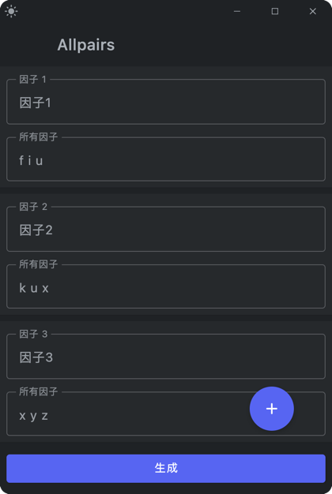
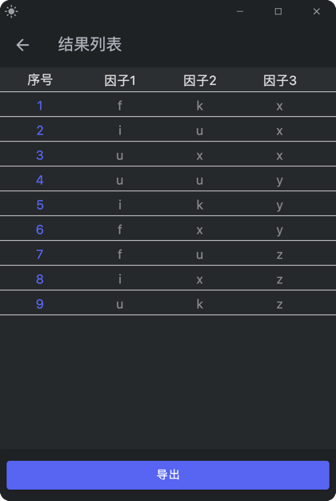
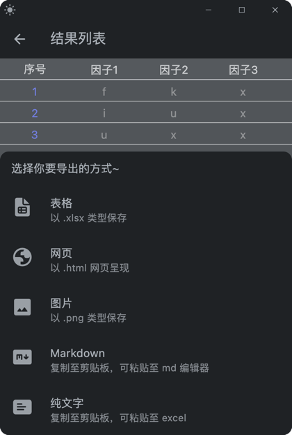

# 介绍

基于 [allpairs4j](https://github.com/pavelicii/allpairs4j) 库打造的 allpairs GUI 小 demo，以进行正交因子计算。

~~不自豪地~~采用 Compose for Desktop 技术进行开发。

# 截图

| 编辑页                               | 结果页                               | 导出页                               |
|-----------------------------------|-----------------------------------|-----------------------------------|
|  |  |  |
|   |   |   |

# 模块

- allpairs-desktop
    - src (compose desktop)
    - library
        - dataroom
        - viewmodel
        - customwindow
        - swipbox
        - swiptodelete

> `library` 模块中的 `dataroom` 和 `viewmodel` 属实验性库，均未在本 demo
> 中应用，且未正式发布（不打算发布，若你有想法，那没问题的）。

# 功能

- [x] 侧滑删除
- [x] 导出结果
    - [x] 表格
    - [x] 图片
    - [x] 纯文字
    - [x] Markdown
    - [x] 网页
- [x] 自定义窗口
- [x] 导出成功询问打开
- [x] 导出失败提示
- [ ] 导入数据
- [x] 侧滑 - 添加项
- [x] 增加动画
  - [x] TopBar
  - [x] Pager
  - [x] 删除因子
  - [x] *（实验）浅深色主题切换过渡

# 起步

1. 配置项目的 SDK 和 Gradle 为 [JBR](https://github.com/JetBrains/JetBrainsRuntime)（JetBrains
   Runtime）,
2. 在你的当前环境调试，借助 `./gradlew run` 编译并运行 compose desktop,
3. 若满意效果并想要打包，借助 `./gradlew package` 编译构建.

> 注意：
> 
> 1. 克隆本项目：`git clone https://github.com/MultiWolf/allpairs-desktop.git`
> 2. 配置 `JBR` 是由于本项目进行了自定义窗口，若运行发现窗口与截图有出入，请检查是否配置 JBR；
> 3. 若运行失败多半是 Gradle 配置存在问题，可以尝试修改 Gradle 为非 JBR；
> 4. 打包命令默认打包当前系统可执行文件，默认可打包 `.dmg`（macOS）、`.exe`（Windows）、`.deb`（Linux）；
> 5. 如需修改支持打包类型，修改 [build.gradle.kts](https://github.com/MultiWolf/allpairs-desktop/blob/main/build.gradle.kts)（root project）中的 `targetFormats`；
> 6. 如需打包不同系统环境下的可执行文件，请在 Gradle 命令中查看诸如 `packagXXX(你期望的类型)` 的命令；
> 7. 你的系统环境下可能无法打包某些目标格式，请参阅[这里](https://github.com/JetBrains/compose-multiplatform/blob/master/tutorials/Native_distributions_and_local_execution/README.md#basic-usage) ;
> 8. 若遇到问题排查无解，欢迎提交 Issue 喵～。

# 一些话

这是我第三次和 Compose 正式打交道了（all platform），感觉自己水平还是太差了。

最近的一次还是去年不得不研究 Fluent UI 2 的时候简单了解了下，至今整个 Compose 学习时长貌似也不到一星期。

最近在上软件测试课程时讲到了正交因子实验，老师介绍使用的 [allpairs4j](https://github.com/pavelicii/allpairs4j)
库，并鼓励我们基于此开发更为简便的程序。要论简便那自然是带 GUI 哇，索性开发个桌面端吧。

虽说之前有开发桌面程序的经验，但无非都是借助 java，包括但不限于 swing、FX 那套东西。虽说可以借助 flatlaf
套一层类 Jetbrains IDEs 主题的皮，但终究还是用的老掉牙技术，不如借此机会再来研究 Compose。

距离第一次接触已经有两年了，但感觉生态还是没什么发展，而当我从命令式 UI 到声明式
UI，从移动到桌面，其实还是不太熟悉的。思维的转换，结构的重思，似乎又回到了当初学习 Android 的感觉，激动且想吐。

本身实现起来问题不大，自信的以为我依旧可以把 ViewModel 等东西搬出来轻松实现状态存续及持久化，但细思发觉哪来这些东西（毕竟不寄生于
ViewGroup 容器，也没有相应的接口。但其实也有办法实现类似的，我已经有大概思路了，但 desktop
还是不太值得我花这么多功夫）。

花了点时间很轻松写了个相当简陋的 demo，和截图类似。想到我的学生 @WindC 曾问到我如何开发桌面程序，便也把截图分享给他了。

他觉得很酷，也想开发，本着老师的职责，不负责的只是简单说了下，丢了个网站和截图，便让他自行探索了。

我本对他没太大期望，但他写的和我的截图效果相差无几，n can run :)。已经大大超过我预期了，当然细究起来还是能发现有很多问题，在此感谢
@ShellWen 参与此次学习并写了个最佳实践：[allpairs-kt](https://github.com/ShellWen/allpairs-kt)。

事实上，当我也参与学习时，我时也感到「Compose 还能这么玩」，惊叹之余又感到莫大的压力：没错，我在原生安卓领域算是小有成就，但我貌似成为了保守派，对诸如
Compose 这样的技术一直保持着谨慎学习的态度，生怕按照~~咕咕~~谷歌的尿性很快又暴死。同时我习惯于借助
ViewGroup 一把嗦，于是就像很多同样开发者所云「有什么必要学呢」。

可事实上，我就是不会这个东西，我缺少了这样一项比较酷炫的技能，我有些压力。也许 Compose
会迎来它的夕阳，但也许在此之前的是我的夕阳。

被急性肠胃炎痛醒来，想到这些，还是学一下吧，至少做好点儿，安抚内心倍感误人子弟的愧疚，便新建该项目草草花了一些时间完成了这个
demo。

代码中除了 library，其他很多代码来自 @ShellWen 的最佳实践，再次致谢。

写的比较粗糙简陋，引用 @WindC 的话：「轻喷呜呜」。

# 致谢

可爱小熊 [@ShellWen](https://github.com/ShellWen)

我的学生 @WindC

第三方库：

- [allpairs4j](https://github.com/pavelicii/allpairs4j)

网站：

- [Jetpack Composes 博物馆](https://jetpackcompose.cn/docs/)
- [Google Fonts](https://fonts.google.com/icons)
- [Fluent Icons](https://fluenticons.co/)

License
-------

    Copyright (c) 2024-present. Fleey

    Licensed under the Apache License, Version 2.0 (the "License");
    you may not use this file except in compliance with the License.
    You may obtain a copy of the License at

       http://www.apache.org/licenses/LICENSE-2.0

    Unless required by applicable law or agreed to in writing, software
    distributed under the License is distributed on an "AS IS" BASIS,
    WITHOUT WARRANTIES OR CONDITIONS OF ANY KIND, either express or implied.
    See the License for the specific language governing permissions and
    limitations under the License.